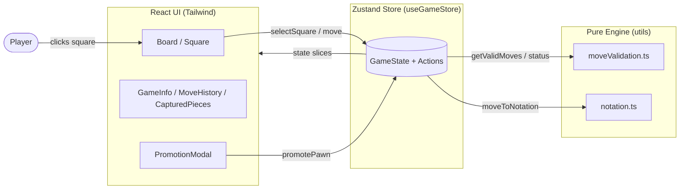

# Basic Chess Board Logic — Step-by-Step Build Guide

> **Archived: original build playbook.** This document is the original roadmap used to build the project from an empty folder to a fully playable chess board. It is intentionally written as a self-contained, step-by-step prompt sequence. The codebase may have evolved since this guide was written, so for current setup, architecture, and deployment notes always defer to [../README.md](../README.md).

---

> **Project Summary:** Basic Chess Board Logic is a fully interactive, two-player (hot-seat) chess application that runs entirely in the browser with no backend. It implements all standard chess rules from scratch — every piece movement, castling (king-side and queen-side), en passant, and pawn promotion — plus real-time check, checkmate, stalemate, and insufficient-material draw detection. The game logic is built as a pure, UI-agnostic engine (pseudo-legal generation followed by legal-move filtering via move simulation), state is held in a single Zustand store, and the interface is a memoized, accessible React component tree styled with Tailwind. The stack favors modern, dependency-light primitives and Unicode chess glyphs instead of image assets.

Each step below is a self-contained prompt. Execute them in order.

Stack: React 19, TypeScript 5, Vite 7, Zustand 5, React Router 7, Tailwind CSS 4, Netlify (hosting).

---

## Table of Contents

**PHASE 1 — Project Foundation**

- STEP 1 — Project Scaffolding & Dependency Setup
- STEP 2 — Domain Type Definitions
- STEP 3 — Board Constants & Initial Setup

**PHASE 2 — Game Engine**

- STEP 4 — Raw (Pseudo-Legal) Move Generation
- STEP 5 — Attack & Check Detection
- STEP 6 — Legal Move Filtering & Game Status
- STEP 7 — Algebraic Notation Converter

**PHASE 3 — State Management**

- STEP 8 — Zustand Game Store & Move Execution

**PHASE 4 — UI Components & Pages**

- STEP 9 — Board & Square Components
- STEP 10 — ChessPiece & Captured Pieces
- STEP 11 — GameInfo, MoveHistory & Promotion Modal
- STEP 12 — Game Page, Routing & App Entry

**PHASE 5 — Polish & Deploy**

- STEP 13 — Global Styles & Animations
- STEP 14 — Accessibility & Performance Pass
- STEP 15 — Production Build & Netlify Deploy

**Appendices**

- Appendix A — Shared Constants & Type Reference
- Appendix B — Common Pitfalls
- Appendix C — Pre-flight Checklist

---

## Global Build Rules (apply to EVERY step)

- **No git operations.** Do not run `git` commands, do not commit, and do not push. Version control is handled manually by the user.
- Do not install unapproved packages. Only add the dependencies listed in STEP 1 unless a later step explicitly requires a new one.
- Do not run long-running processes (dev servers, watchers) unless the user requests it. Prefer a one-shot `npm run build` to verify.
- Treat every step as self-contained: it states its goal, the files it touches, the implementation notes, and an acceptance check.
- Keep code clean, readable, and typed. Function and variable names are English and `camelCase`.
- Prefer modern syntax (ES6+, React Hooks, `async/await` where relevant) and native methods over new dependencies (DRY, reusable).
- Prioritize security, accessibility (a11y), and performance throughout.

---

## Architecture at a Glance

The app is a single-page, client-only React application. A pure engine module produces and validates moves; a Zustand store is the single source of truth; React components subscribe to slices of that store and render the board and sidebar.



Key boundaries:

- **Engine (`src/utils`)** is framework-agnostic and side-effect free. It takes a `Board` plus context and returns data. It must never import React or the store.
- **Store (`src/store`)** orchestrates engine calls and holds mutable game state.
- **Components (`src/components`, `src/pages`)** are presentational and read state via selectors; they never embed chess rules.

---

# PHASE 1 — PROJECT FOUNDATION

---

## STEP 1 — Project Scaffolding & Dependency Setup

**Goal:** Create a Vite + React + TypeScript project wired with Tailwind CSS 4, Zustand, and React Router.

**Files/folders to create or edit:**

- `package.json`, `vite.config.ts`, `tsconfig.json`, `tsconfig.app.json`
- `index.html`, `src/main.tsx`, `src/index.css`
- `netlify.toml`, `.gitignore`

**Dependencies:**

```bash
# runtime
react react-dom react-router-dom zustand
# dev / build
vite @vitejs/plugin-react typescript @tailwindcss/vite tailwindcss
```

**Implementation notes:**

- Configure Vite with the React and Tailwind plugins, and a dev server on port `3000` with `open: true`:

```typescript
import { defineConfig } from "vite";
import react from "@vitejs/plugin-react";
import tailwindcss from "@tailwindcss/vite";

export default defineConfig({
  plugins: [react(), tailwindcss()],
  server: { port: 3000, open: true },
});
```

- `index.html` sets `lang="en"`, a description meta tag, the SVG favicon, and a dark `body` (`bg-gray-950 text-white antialiased`) with a `#root` mount node.
- `src/index.css` starts with `@import "tailwindcss";` (Tailwind 4 single-import style). Animations come later in STEP 13.
- Define the npm scripts: `dev` → `vite`, `build` → `tsc -b && vite build`, `preview` → `vite preview`.

**Acceptance check:** `npm install` succeeds and `npm run build` produces a `dist/` folder with no type errors.

---

## STEP 2 — Domain Type Definitions

**Goal:** Establish the single source of truth for all chess domain types so every later module is fully typed.

**Files:** `src/types/chess.ts`

**Implementation notes:** Define these types exactly:

- `PieceColor = "white" | "black"`
- `PieceType = "king" | "queen" | "rook" | "bishop" | "knight" | "pawn"`
- `Piece { type; color; hasMoved }` — `hasMoved` is required for castling and pawn double-step logic.
- `Position = [number, number]` — `[row, col]`, 0-indexed from the top-left.
- `Square = Piece | null` and `Board = Square[][]` (8×8).
- `Move { from; to; piece; captured?; isEnPassant?; isCastling?; isPromotion?; promotedTo? }`.
- `GameStatus = "playing" | "check" | "checkmate" | "stalemate" | "draw"`.
- `GameState { board; currentTurn; selectedPosition; validMoves; moveHistory; capturedPieces; gameStatus; lastMove; enPassantTarget }`.

**Acceptance check:** The file compiles and exports all types; no runtime code lives here.

---

## STEP 3 — Board Constants & Initial Setup

**Goal:** Centralize board dimensions, Unicode glyphs, coordinate labels, and the initial position factory.

**Files:** `src/constants/board.ts`

**Implementation notes:**

- `BOARD_SIZE = 8`.
- `PIECE_SYMBOLS: Record<PieceColor, Record<PieceType, string>>` mapping each piece to its Unicode glyph (e.g. white king `♔`, black king `♚`). Using glyphs avoids image assets entirely.
- `FILE_LABELS = ["a".."h"]` and `RANK_LABELS = ["8".."1"]` (rank labels are top-to-bottom because row 0 is the top / black's back rank).
- `createInitialBoard(): Board` builds an 8×8 array of `null`, then places the back-rank order `[rook, knight, bishop, queen, king, bishop, knight, rook]` for black on rows 0–1 and white on rows 6–7, all with `hasMoved: false`.

**Acceptance check:** `createInitialBoard()` returns 32 pieces in the standard starting position; kings on column 4.

---

# PHASE 2 — GAME ENGINE

---

## STEP 4 — Raw (Pseudo-Legal) Move Generation

**Goal:** Generate every move a piece could make ignoring checks/pins. This is the foundation the legal filter builds on.

**Files:** `src/utils/moveValidation.ts`

**Implementation notes:**

- Add private helpers: `isInBounds`, `getPiece`, `cloneBoard` (deep clone for simulation), `opponentColor`.
- Define direction vectors: `ROOK_DIRECTIONS`, `BISHOP_DIRECTIONS`, `QUEEN_DIRECTIONS = [...rook, ...bishop]`, and `KNIGHT_OFFSETS`.
- Implement per-piece generators:
  - `getSlidingMoves` (rook/bishop/queen): walk each direction until blocked; include an enemy piece as a capture then stop.
  - `getKnightMoves`: the 8 L-offsets filtered by bounds and friendly occupancy.
  - `getPawnMoves`: forward one (and two from the start row `6` white / `1` black) when empty; diagonal captures; **en passant** when the target matches `enPassantTarget`. Direction is `-1` for white, `+1` for black.
  - `getKingMoves`: the 8 adjacent squares, plus **castling** — only when the king has not moved, the relevant rook exists and has not moved, the intervening squares are empty, and the king's start/transit/destination squares are not attacked.
- Wrap them in `getRawMoves(board, position, enPassantTarget)` that switches on piece type.

**Acceptance check:** From the initial board, each knight returns 2 moves and each edge pawn returns 2 (one- and two-step). Castling never appears while pieces block the back rank.

---

## STEP 5 — Attack & Check Detection

**Goal:** Determine whether a square is attacked and whether a king is in check — needed for castling safety and legality.

**Files:** `src/utils/moveValidation.ts` (same module)

**Implementation notes:**

- `isSquareAttacked(board, [row,col], byColor)` checks, in order: knight offsets, sliding rook/queen lines, sliding bishop/queen diagonals, pawn attacks (note the pawn attack direction is the inverse of its move direction), and adjacent enemy king (prevents kings from standing next to each other). Export it (castling in STEP 4 depends on it).
- `findKing(board, color)` scans the board for the matching king and returns its `Position`.
- `isInCheck(board, color)` = `isSquareAttacked(kingPos, opponentColor(color))`.

**Acceptance check:** A rook placed on an open file with the enemy king reports `isInCheck === true`; blocking the file with any piece makes it `false`.

---

## STEP 6 — Legal Move Filtering & Game Status

**Goal:** Convert pseudo-legal moves into truly legal ones and derive end-of-game states.

**Files:** `src/utils/moveValidation.ts` (same module)

**Implementation notes:**

- `doesMoveCauseCheck(board, from, to, color)`: clone the board, apply the move, and additionally replicate the side effects so the simulation is accurate — remove the en-passant-captured pawn, and move the rook for castling — then return `isInCheck(simBoard, color)`.
- `getValidMoves(board, position, enPassantTarget)`: take `getRawMoves` and filter out any move where `doesMoveCauseCheck` is true.
- `hasLegalMoves(board, color, enPassantTarget)`: true if any friendly piece has at least one valid move.
- `isInsufficientMaterial(board)`: true for K vs K, K + single minor (bishop or knight) vs K, and **K+B vs K+B only when both bishops sit on the same-colored square** — compute square color as `(row + col) % 2`; opposite-colored bishops are not an automatic draw.
- These feed the store's status resolver (STEP 8): in-check + no legal moves → `checkmate`; not-in-check + no legal moves → `stalemate`; insufficient material → `draw`; in-check → `check`; else `playing`.

**Acceptance check:** A pinned piece cannot "move away" (its illegal moves are filtered), and a back-rank mate position resolves to no legal moves.

---

## STEP 7 — Algebraic Notation Converter

**Goal:** Render moves as standard algebraic notation for the history panel.

**Files:** `src/utils/notation.ts`

**Implementation notes:**

- `PIECE_LETTERS` maps piece types to letters (`K Q R B N`, pawn is empty).
- `positionToAlgebraic([row,col])` → `FILE_LABELS[col] + RANK_LABELS[row]`.
- `moveToNotation(move)`: castling → `O-O` / `O-O-O`; otherwise compose `pieceLetter + (pawn-capture from-file) + capture("x") + destination + promotion("=Q" etc.)`.

**Acceptance check:** `e2→e4` renders `e4`; a king-side castle renders `O-O`; a pawn capture to `d6` renders `exd6` style output.

> Note: check (`+`) and mate (`#`) suffixes are not appended in the base implementation; this is a known simplification (see Appendix B).

---

# PHASE 3 — STATE MANAGEMENT

---

## STEP 8 — Zustand Game Store & Move Execution

**Goal:** Hold the whole game in one store and orchestrate engine calls on each interaction.

**Files:** `src/store/useGameStore.ts`

**Implementation notes:**

- Compose the store type as `GameState & GameActions & PromotionState`, where actions are `selectSquare`, `promotePawn`, `resetGame`, and `PromotionState` carries `pendingPromotion`.
- `createInitialState()` seeds the board via `createInitialBoard()`, white to move, empty histories.
- `selectSquare(position)`:
  - Ignore clicks when the game is over or a promotion is pending.
  - If a piece is already selected and the click is a valid destination → execute the move; if it is another friendly piece → reselect; otherwise → deselect.
  - With nothing selected, select only a current-turn piece and compute `validMoves`.
- Extract `executeMove(to, set, get)` for readability. It clones the board, detects `isCastling` / `isEnPassant` / `isPromotion`, and:
  - For promotion, stash `pendingPromotion` and return early (the modal completes it).
  - Otherwise apply the move (`hasMoved: true`), remove the en-passant pawn, relocate the rook for castling, compute the next `enPassantTarget` (only on a pawn double-step), record the `Move`, update `capturedPieces`, flip the turn, and resolve `gameStatus` via the STEP 6 helpers.
- `promotePawn(pieceType)` finalizes a stashed promotion with the chosen piece, then resolves status with `enPassantTarget = null`.
- `resetGame()` returns to `createInitialState()`.

**Acceptance check:** Playing a legal sequence updates turn, history, and captured pieces; reaching a back-rank mate sets `gameStatus === "checkmate"`.

---

# PHASE 4 — UI COMPONENTS & PAGES

---

## STEP 9 — Board & Square Components

**Goal:** Render the 8×8 grid and individual squares with all visual states.

**Files:** `src/components/Board.tsx`, `src/components/Square.tsx`

**Implementation notes:**

- `Board` reads `board`, `currentTurn`, `selectedPosition`, `validMoves`, `lastMove`, `gameStatus`, and `selectSquare` via individual selectors. It precomputes a **module-level `BOARD_POSITIONS` table** of stable `[row, col]` arrays so the memoized `Square` children do not re-render on unrelated state changes. It also computes the king-in-check square for highlighting.
- `Square` is wrapped in `memo`. It is a `<button>` (keyboard/focus friendly) with: light/dark base color from `(row + col) % 2`, selected ring, last-move highlight, king-in-check class, coordinate labels on the bottom row / left column, the piece, and the valid-move dot / capture ring indicators.

**Acceptance check:** Selecting a piece shows dots on empty legal targets and rings on capturable squares; the last move stays highlighted.

---

## STEP 10 — ChessPiece & Captured Pieces

**Goal:** Render piece glyphs and the captured-material trays.

**Files:** `src/components/ChessPiece.tsx`, `src/components/CapturedPieces.tsx`

**Implementation notes:**

- `ChessPiece` (memoized) renders `PIECE_SYMBOLS[color][type]` with a drop-shadow that differs by color for contrast, plus hover/selected scale classes and an `aria-label`.
- `CapturedPieces` takes a `color` prop, reads `capturedPieces[color]` from the store, returns `null` when empty, and renders the glyphs sorted by piece value (queen → pawn).

**Acceptance check:** Capturing a pawn adds its glyph to the correct tray, sorted ahead of nothing/behind higher-value pieces.

---

## STEP 11 — GameInfo, MoveHistory & Promotion Modal

**Goal:** Build the sidebar status, the notation log, and the accessible promotion picker.

**Files:** `src/components/GameInfo.tsx`, `src/components/MoveHistory.tsx`, `src/components/PromotionModal.tsx`

**Implementation notes:**

- `GameInfo`: a status badge whose text/color reflect `gameStatus` (turn, check, checkmate winner, stalemate/draw), a turn indicator with the move number, and a reset button labeled "New Game" / "Play Again".
- `MoveHistory`: groups `moveHistory` into white/black pairs, renders them in a scrollable panel, and auto-scrolls to the bottom on each new move via a `ref` + `useEffect`.
- `PromotionModal`: returns `null` unless `pendingPromotion` is set. It is a `role="dialog"` `aria-modal` overlay offering Queen/Rook/Bishop/Knight. It **manages focus**: auto-focus the first option on open, arrow keys move between options, and `Tab`/`Shift+Tab` are trapped inside the modal (a choice is mandatory).

**Acceptance check:** Promoting a pawn opens the modal, the first button is focused, arrow keys cycle options, and choosing one places the selected piece and resumes play.

---

## STEP 12 — Game Page, Routing & App Entry

**Goal:** Assemble the responsive layout and bootstrap the app.

**Files:** `src/pages/GamePage.tsx`, `src/App.tsx`, `src/main.tsx`

**Implementation notes:**

- `GamePage` lays out a header, the board flanked by black/white captured trays, a sidebar (`GameInfo` + `MoveHistory`), a footer, and the `PromotionModal`. It is responsive (`flex-col` on mobile → `lg:flex-row`).
- `App` defines routes with React Router (`/` → `GamePage`).
- `main.tsx` mounts `<App />` inside `<StrictMode>` and `<BrowserRouter>`, importing `./index.css`.

**Acceptance check:** `npm run dev` serves a playable board at `/`; the layout reflows cleanly between mobile and desktop widths.

---

# PHASE 5 — POLISH & DEPLOY

---

## STEP 13 — Global Styles & Animations

**Goal:** Add the custom animations and base styles referenced by the components.

**Files:** `src/index.css`

**Implementation notes:** Under Tailwind's `@layer` directives, define: a base `body` font stack; `.piece-hover` / `.piece-selected` scale transitions; a `pulse-dot` keyframe for the `.valid-move-dot`; a `.last-move-highlight` background; and a `.king-in-check` class with a `check-pulse` keyframe (inset red box-shadow). These class names must match exactly what `Square` and `ChessPiece` apply.

**Acceptance check:** Valid-move dots pulse, the checked king's square pulses red, and selecting a piece scales it slightly.

---

## STEP 14 — Accessibility & Performance Pass

**Goal:** Make the board usable and fast.

**Implementation notes:**

- Accessibility: squares are real `<button>`s with descriptive `aria-label`s (coordinate + piece); pieces expose `role="img"` labels; the modal uses `aria-modal` with focus management and a focus trap; focus-visible rings are present.
- Performance: memoize `Square` and `ChessPiece`; keep `BOARD_POSITIONS` stable; subscribe to narrow store slices rather than the whole state; keep the engine allocation-light (only `cloneBoard` during simulation).

**Acceptance check:** Tabbing reaches every square and modal control; React DevTools shows only relevant squares re-rendering after a move.

---

## STEP 15 — Production Build & Netlify Deploy

**Goal:** Ship the static site with SPA routing support.

**Files:** `netlify.toml`

**Implementation notes:**

- Build command `npm run build`, publish directory `dist`.
- Add an SPA fallback redirect so client-side routes resolve:

```toml
[build]
  command = "npm run build"
  publish = "dist"

[[redirects]]
  from = "/*"
  to = "/index.html"
  status = 200
```

- Verify locally with `npm run build` (the `tsc -b` step must pass with zero type errors) and optionally `npm run preview`.

**Acceptance check:** `npm run build` exits 0 and emits hashed assets under `dist/`; the deployed site loads and plays.

---

# Appendix A — Shared Constants & Type Reference

- **Coordinate system:** `Position = [row, col]`, 0-indexed, row 0 is the top (black's back rank). Square color: `(row + col) % 2 === 0` is light.
- **Pawn directions:** white moves with `-1` (up the array), black with `+1`. Start rows: white `6`, black `1`. Promotion rows: white `0`, black `7`.
- **Back-rank order:** `["rook","knight","bishop","queen","king","bishop","knight","rook"]`.
- **Castling targets:** king-side king lands on column `6`; queen-side on column `2`. Rook relocates to `5` and `3` respectively.
- **Exported engine API:** `isSquareAttacked`, `findKing`, `isInCheck`, `getValidMoves`, `hasLegalMoves`, `isInsufficientMaterial`.

# Appendix B — Common Pitfalls

- **Simulating side effects:** legal-move filtering must replicate en passant capture removal and the castling rook move, or pinned/illegal castles slip through.
- **Insufficient material:** judge bishops by their **square color** (`(row+col)%2`), not by which side owns them. Opposite-colored bishops can still mate.
- **Stable references:** recreating `[row, col]` arrays per render defeats `memo` on `Square`. Use the precomputed `BOARD_POSITIONS` table.
- **Pawn attack direction:** in `isSquareAttacked`, pawns attack opposite to their forward move direction — getting this backwards breaks check detection.
- **Notation suffixes:** `+` (check) and `#` (mate) are not currently appended; add them in `moveToNotation` if exact PGN-style output is required.
- **Promotion flow:** the move is paused (`pendingPromotion`) until the modal resolves; do not advance the turn before `promotePawn` runs.

# Appendix C — Pre-flight Checklist

- [ ] `npm install` completes cleanly.
- [ ] `npm run build` passes `tsc -b` with no type errors and emits `dist/`.
- [ ] Initial position renders with 32 pieces, white to move.
- [ ] Castling, en passant, and promotion all work end-to-end.
- [ ] Check highlights the king; checkmate / stalemate / insufficient-material draws resolve correctly.
- [ ] Move history shows correct algebraic notation and captured trays update.
- [ ] Keyboard navigation and modal focus trap behave as expected.
- [ ] `netlify.toml` SPA redirect is present.
